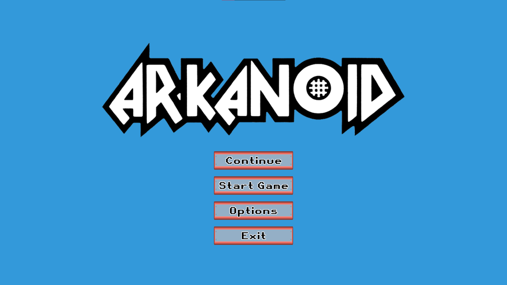
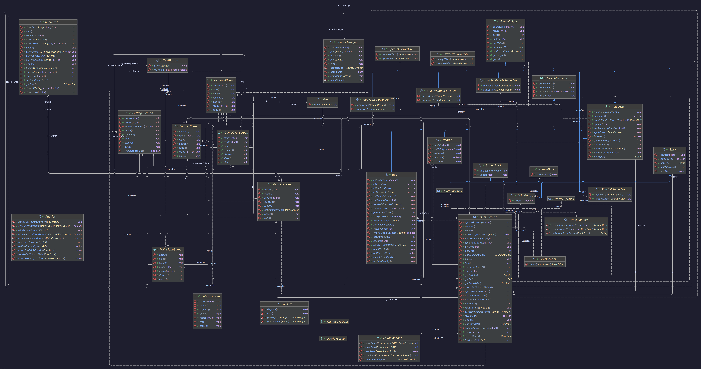
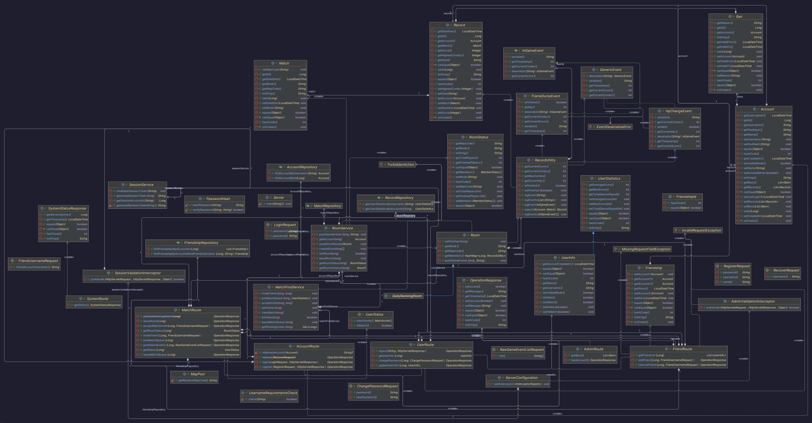
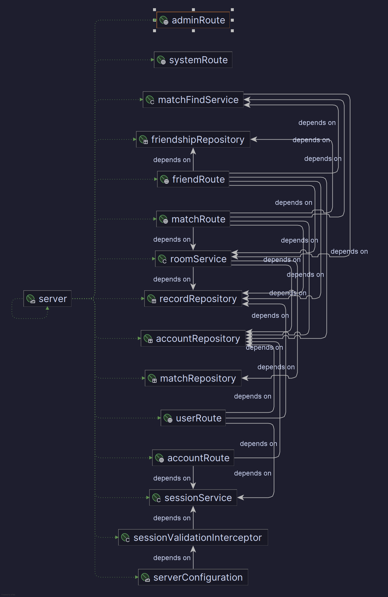

# Exterminator3618

[](https://github.com/im-yuuki/Exterminator3618/actions/workflows/build-jar.yml)
[](https://github.com/im-yuuki/Exterminator3618/actions/workflows/build-jar.yml)

*This game is our team project for the Object-Oriented Programming course at the University of Engineering and Technology (UET), Vietnam National University.*

## ✨ Features
- Classical Arkanoid-style gameplay
- Variety of brick types and power-ups
- Multiple levels with increasing difficulty
- Save game progress and continue where you left off
- Online features: user accounts, 1v1 multiplayer mode, statistics, friend system, ...
- Cross-platform support: Windows, macOS, Linux

## 💻 Screenshots



## 🎮 Build and run
- **Stable:** Download the latest release from the [Releases](https://github.com/im-yuuki/Exterminator3618/releases) page.
- **Nightly:** Download the latest build from the [Actions](https://github.com/im-yuuki/Exterminator3618/actions/workflows/build-jar.yml) page.
- **Build from source:**
  1. Setup JDK and Maven on your system.
  2. Clone this repository.
  3. Build for desktop: The output JAR file will be located in `desktop/target/`.
     ```bash
     mvn -f ./pom.xml clean install
     mvn -f ./desktop/pom.xml clean package
     ```
  4. Build for server: The output JAR file will be located in `server/target/`.
     ```bash
     mvn -f ./server/pom.xml clean package spring-boot:repackage
     ```
     
> [!NOTE]
> This project requires Java 21 or higher.\
> Make sure you have Java 21+ installed on your system.\
> We recommend using Adoptium Temurin® JDK (https://adoptium.net/temurin/releases)
 
## 📚 Used frameworks/libraries
- [libGDX](https://libgdx.com/) - A cross-platform Java game development framework.
- [Jackson Databind](https://github.com/FasterXML/jackson) - A library for processing JSON data in Java.
- [Spring Boot](https://spring.io/projects/spring-boot) - A framework for building production-ready applications in Java.
- [Hibernate](https://hibernate.org/) - An object-relational mapping (ORM) tool for Java.
- [MySQL](https://www.mysql.com/) - A relational database management system.
- [Maven](https://maven.apache.org/) - A build automation tool used primarily for Java projects.

## 🏫 Team members
- @maaL6 Tran Duc Lam (24020197) - Team leader
- @im-yuuki Le Dang Ngo Dan (24020054)
- @BakaAfk Nguyen Xuan Bac (24020036)
- @ngocmai3438 Pham Ngoc Mai (24020216)

*📀 We keep track of the progress in this [GitHub Project](https://github.com/users/im-yuuki/projects/2) site.*

## 📝Architecture diagram (commit f0d4f1af5df58d55fbd364bf59d84c60aeb72d3c)

### Client


### Server


### Server (Spring Beans)


*2025 © Exterminator3618 Team. Licensed under the [GNU AGPL-3.0 License](./LICENSE).*